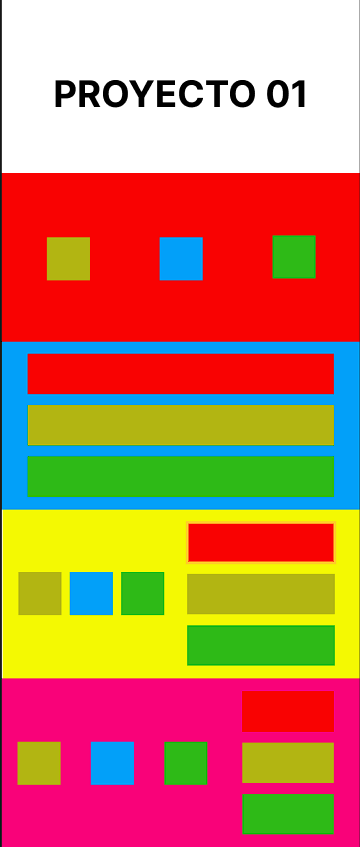
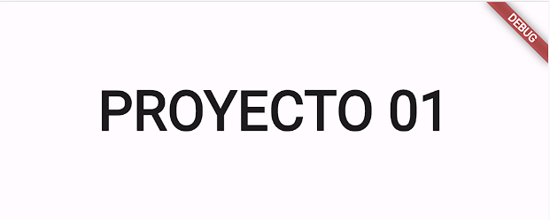
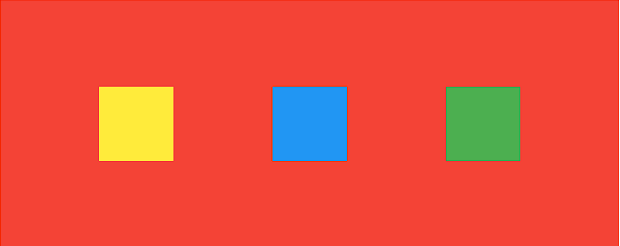
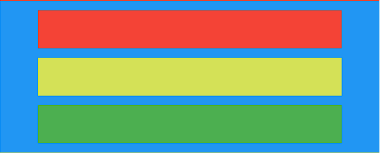
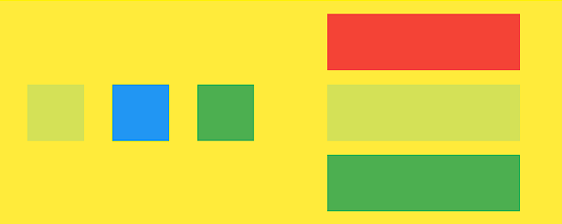
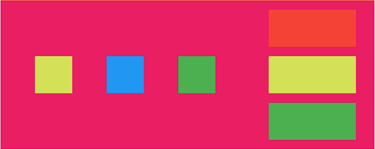
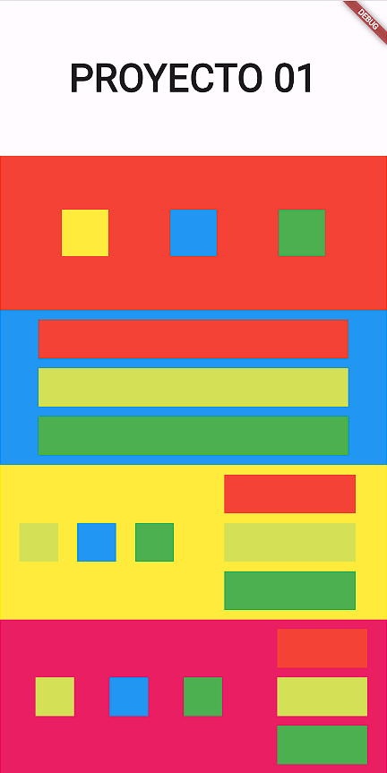

# BrunRodriguezA01

## EJERCICIO 01

Deberás crear un proyecto correctamente nombrado y crear su repositorio en Github. La aplicación deberá parecerse al figma proporcionado. Como extra deberá poder hacer scroll en la pantalla.
Figma:

## Comentario

La aplicación cuenta con los siguientes elementos:
* Un Safe Area, para ignorar las obstrucciones de las camaras y o botones que puedan tener los dispositivos físicos.
* Un SingleChildScrollView, que permite hacer scroll vertical porque los elementos de la aplicación no entran por completo en la pantalla.
* Un SizeBox de color blanco y altura de 200. Contiene un texto centrado Proyecto 01.

* Un Container color rojo y altura de 200. Contiene una fila con 3 contenedores de colores.

* Un Container de color azul y altura de 200. Contiene una columna con 3 contenedores de colores que se expanden infinitamente. (double.infinity) cada uno de estos contenedores son hijos de un widget Padding que aplica un padding dependiente del tamaño de la pantalla: 
  
(Padding(padding: EdgeInsets.symmetric(horizontal: screenWidth * 0.1,),child: Container(height: 50,width: double.infinity,color: Colors.red,),))

* Un Container de color amarillo y de altura 200. Este contiene una fila que a su vez contiene dos widget Expanded. El primer Expandend contiene una Fila con 3 contenedores de colores y el segundo una Columna con 3 contenedores de colores. Los containers de esta Columna también tienen una anchura infinita y son hijos de un widget Padding que aplica el padding dependiendo de la aunchura del dispositivo. A los expanded se les aplica la propiedad flex: 1 para que tanto la Fila como la Columna ocupen el mismo ancho en la pantalla.

* Un Container de color rosa y de altura 200. Este contiene una fila que a su vez contiene dos widget Expanded. El primer Expandend contiene una Fila con 3 contenedores de colores y el segundo una Columna con 3 contenedores de colores. Los containers de esta Columna también tienen una anchura infinita y son hijos de un widget Padding que aplica el padding dependiendo de la aunchura del dispositivo. Al primer Expanded le aplicamos el atributo flex: 2 y al segundo flex: 1. De esta manera la Fila ocupará 2/3 de la pantalla y la Columna 1/3.

Resultado final:

